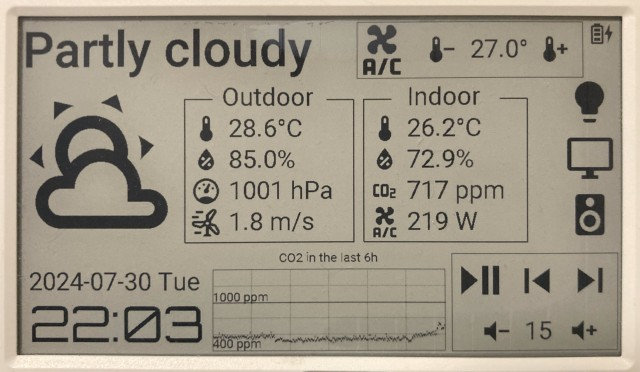

# m5paper_esphome

Based on https://github.com/timit3-github/m5paper_esphome

Itself based on https://github.com/paveldn/m5paper_esphome

Itself based on https://github.com/sebirdman/m5paper_esphome

Work in progress

All components are functional, but likely have bugs. 

Please, download font from https://materialdesignicons.com/ and put in 'fonts' folder

BM8563 work based on: https://github.com/TomG736/esphome-BM8563

Install with ESPHome Builder :
Open a Home Assistant terminal
Cd to config/esphome
Create a git directory
Cd to git
Git clone this repository
Copy test.yaml to config/esphome/m5paper.yaml
Build and install from ESPHome Builder